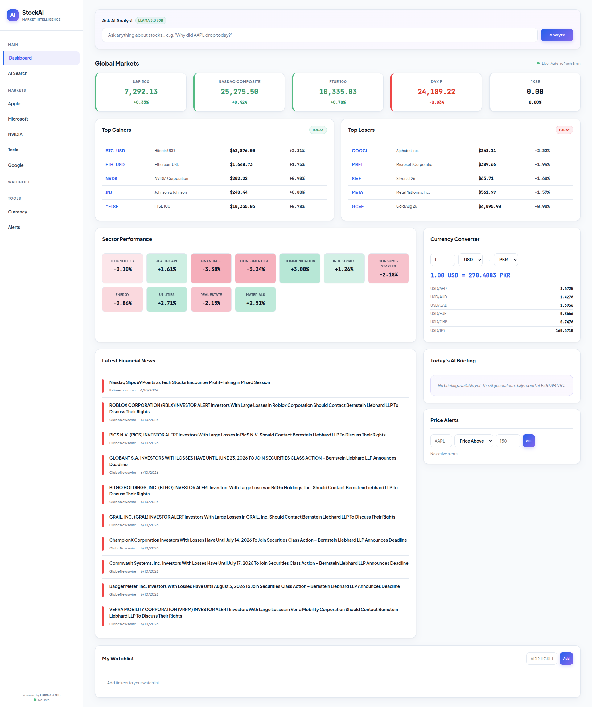
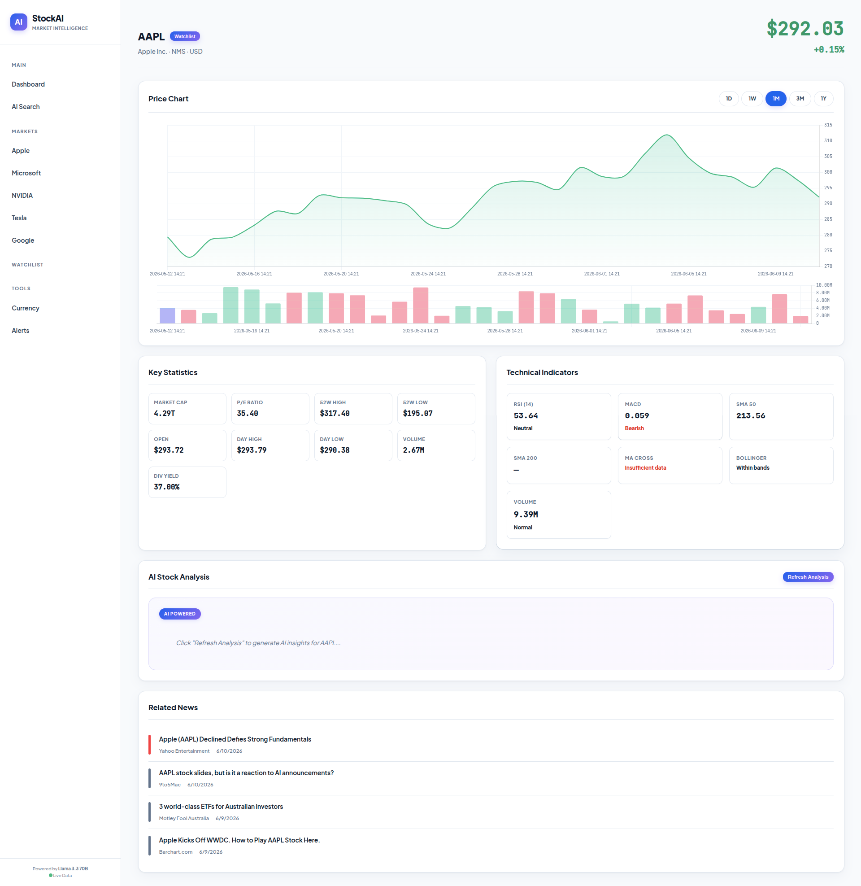
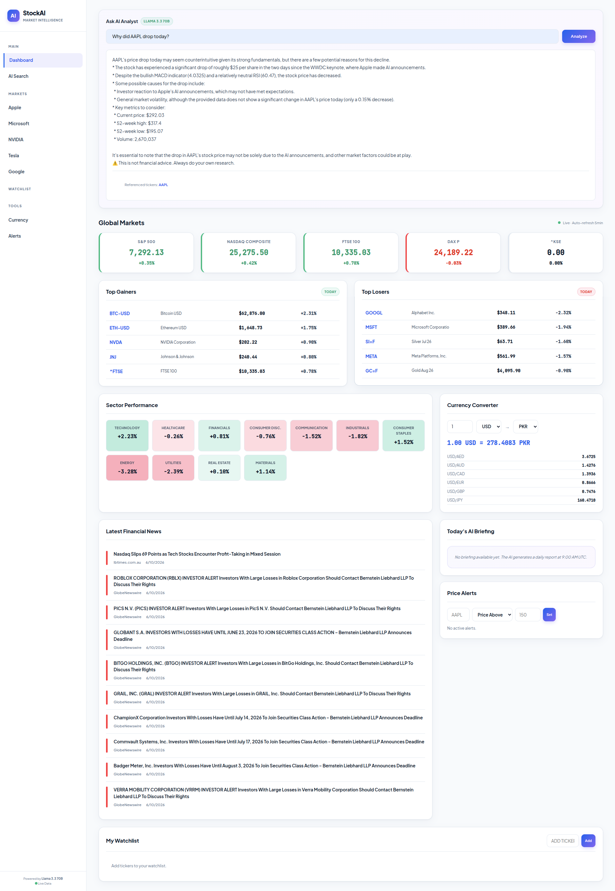

# StockAI Analyst — Global Market Intelligence Platform

StockAI Analyst is a premium, real-time financial market analytics dashboard. Powered by a Flask backend, Celery background workers, PostgreSQL (with pgvector), and Redis, it processes live ticker data, feeds sentiment-scored financial news into a RAG (Retrieval-Augmented Generation) pipeline, and delivers instant AI-driven market analysis using DeepInfra Llama 3.3.

---

## 🚀 Key Features

* **Interactive Stock Charting**: High-fidelity price action charts with moving averages, technical indicator overlays, and a robust random-walk simulation fallback.
* **AI Market Analyst**: One-click professional AI market briefings and interactive Q&A powered by the **Llama 3.3 70B** model.
* **Financial News Feed & Sentiment**: Automated hourly background worker fetches news articles, analyzes their sentiment using AI, and indexes them into PostgreSQL via **BGE-M3** vector embeddings.
* **Technical Indicators (TA-Lib / pandas-ta)**: Instant calculation of RSI, MACD, and Bollinger Bands with plain-English signal interpretation.
* **Smart Currency Converter**: Multi-currency conversion supporting USD, EUR, GBP, JPY, PKR, AED, SAR, CAD, and AUD.
* **Real-time Price Alerts**: Alert triggers matching custom target thresholds.
* **Premium Design**: Modern, responsive, light-themed user interface designed for readability and premium user experience.

---

## 🛠️ Tech Stack

* **Backend**: Python 3.12, Flask, Gunicorn, Eventlet
* **Task Queue**: Celery (worker + beat schedule)
* **Databases**: PostgreSQL (with pgvector for RAG), Redis (caching and broker)
* **AI Integration**: DeepInfra (Llama 3.3 70B Instruct & BGE-M3 Embeddings)
* **APIs**: Yahoo Finance (yfinance), NewsAPI, ExchangeRate-API
* **Frontend**: HTML5, Tailwind-free Vanilla CSS, Vanilla JS, Chart.js, Socket.IO

---

## 📥 Getting Started

### 📋 Prerequisites
Make sure you have [Docker](https://docs.docker.com/get-docker/) and [Docker Compose](https://docs.docker.com/compose/install/) installed.

### ⚙️ Environment Configuration
Create a `.env` file in the `backend` directory by copying `.env.example` from the root:
```bash
cp .env.example backend/.env
```
Update the keys in `backend/.env`:
* `DEEPINFRA_API_KEY`: Your DeepInfra API key
* `NEWS_API_KEY`: NewsAPI.org API key
* `EXCHANGE_RATE_API_KEY`: ExchangeRate-API key

### ⚡ Running the Platform

1. **Build and start the application containers**:
   ```bash
   docker compose up -d --build
   ```

2. **Verify container status**:
   ```bash
   docker compose ps
   ```

3. **Open the web dashboard**:
   Access the UI at [http://localhost:5000](http://localhost:5000).

---

## 📸 Screenshots

*Replace the placeholder references below with your actual screenshot images.*

### Main Dashboard View


### Stock Technical Analysis & Charting


### AI Analyst briefing & RAG Q&A


---

## 📤 Pushing to GitHub

To push this project to your GitHub repository, execute the following commands in your terminal:

1. **Initialize the local Git repository**:
   ```bash
   git init
   ```

2. **Rename default branch to `main`**:
   ```bash
   git branch -M main
   ```

3. **Verify the `.gitignore` file**:
   A `.gitignore` file is already configured in the root directory to automatically exclude virtual environments, the `.env` configuration, and runtime databases from git tracking.

4. **Add all files to staging**:
   ```bash
   git add .
   ```

5. **Commit the changes**:
   ```bash
   git commit -m "Initial commit - StockAI Analyst Platform"
   ```

6. **Add the remote GitHub repository link**:
   *(Replace `<USERNAME>` and `<REPO_NAME>` with your GitHub info)*
   ```bash
   git remote add origin https://github.com/<USERNAME>/<REPO_NAME>.git
   ```

7. **Push to GitHub**:
   ```bash
   git push -u origin main
   ```
